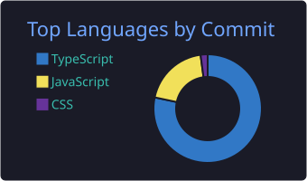
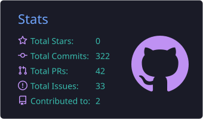

 

**AI Enablement & Growth Infrastructure Lead**

I design and ship production AI systems that connect engineering,
quality, governance and measurable business outcomes.

<table>
<tr>
<td width="33%" align="center">

### 60%+

less manual triage

</td>
<td width="33%" align="center">

### 6

business units enabled

</td>
<td width="33%" align="center">

### 3

production system pillars

</td>
</tr>
</table>

---

## ⚔️ Current Mission

<table>
<tr>
<td width="50%" valign="top">

### Building

- Production agents with autonomous remediation
- Spec-to-feature multi-agent delivery pipelines
- Playwright quality systems with AI-assisted testing
- Reusable automation for cross-functional teams

</td>
<td width="50%" valign="top">

### Leading

- AI roadmap and enablement in AdTech
- AWS Bedrock and Agent Core adoption
- Governance, PII policies and responsible AI
- AI Champions across six business units

</td>
</tr>
</table>

> **Operating principle:** automation accelerates judgment; it does not replace it.

---

## 🏰 Systems in Production

<table>
<tr>
<td width="33%" valign="top">

### ⚡ Auto-Remediation

`Sentry → Bedrock → Fix → PR`

Multi-agent detection, diagnosis and autonomous pull requests.

**Impact:** 60%+ less manual triage.

</td>
<td width="33%" valign="top">

### 🏗️ Auto-Dev Pipeline

`Specs → Code → UI → Tests → Docs`

An orchestrator routes work to specialized agents for complete feature delivery.

**Focus:** consistency and reviewability.

</td>
<td width="33%" valign="top">

### 🛡️ Governance Layer

`Catalog → Policy → Access → Audit`

OpenMetadata-based controls for safe AI adoption across the organization.

**Scope:** six business units.

</td>
</tr>
</table>

---

## 🧭 How I Build

`01 · DISCOVER`　→　`02 · PROTOTYPE`　→　`03 · MEASURE`　→　`04 · STANDARDIZE`

Find the real constraint · Ship the smallest useful system · Prove impact · Turn it into a reusable operating model

---

## 🏆 Achievement Realm

Live tiers generated from GitHub activity · refreshed automatically every 30 minutes

---

## 📜 Explorer's Ledger

---

## 🛠️ Technical Arsenal

<table>
<tr>
<td width="33%" valign="top">

### AI & Agents

</td>
<td width="33%" valign="top">

### Cloud & Platform

</td>
<td width="33%" valign="top">

### Development & QA

</td>
</tr>
</table>

---

## 🎓 Credentials

- **BSc Telecommunications Engineering** — Universitat Oberta de Catalunya
- **PCAP** — Python Essentials, OpenEDG
- **PSM I** — Professional Scrum Master I

---

### Ready for the next quest?

I enjoy turning difficult automation problems into systems teams can trust,
measure and reuse.

 

Based in León, Spain · Working remotely

