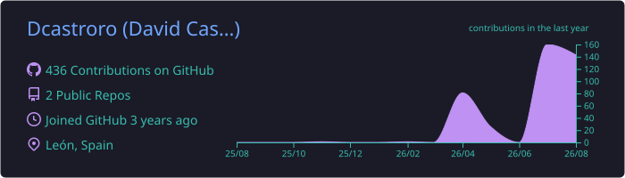

 

**AI Enablement & Growth Infrastructure Lead**

I design and ship production AI systems that connect engineering,
quality and measurable business outcomes.

---

Selected work is intentionally described at a high level. Internal architecture, controls and operational details are not disclosed.

---

## 🏆 Achievement Realm

Live tiers generated from GitHub activity · refreshed automatically every 30 minutes

---

## 📜 Explorer's Ledger

---

## 🛠️ Technical Arsenal

---

